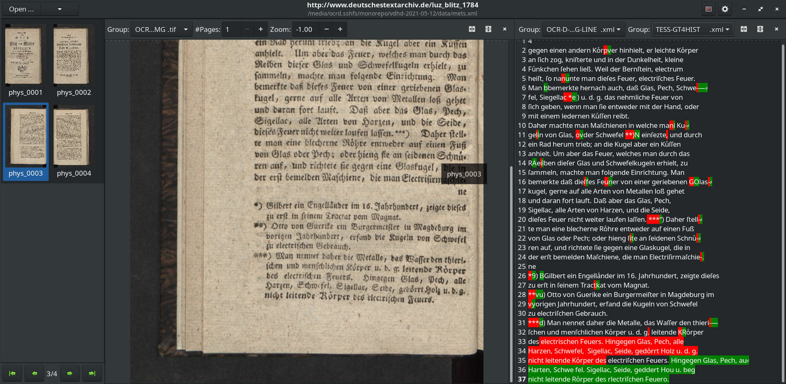

# Demos OCR-D

## Demo 0 - install ocrd_all or `ocrd/all`

> Install OCR-D locally

### Read https://ocr-d.de/en/setup guide

### Decide for native or Docker installation

### Install (native)

    git clone https://github.com/OCR-D/ocrd_all
    cd ocrd_all
    sudo make deps-ubuntu
    make all
    . venv/bin/activate

### Install (Docker)

    docker pull ocrd/all:maximum
    # or:
    docker pull ocrd/all:maximum-cuda
    mkdir -p models data
    docker run --rm -it -v $PWD/data:/data -v ocrd-models:/models \
        ocrd/all:maximum bash

(Or, to share models between native and Docker, mount `$HOME/.local/share/ocrd-resources` instead of the named volume `ocrd-models`.)

### Download models

    ocrd resmgr list-available
    ocrd resmgr download ocrd-tesserocr-recognize deu.traineddata
    ocrd resmgr download ocrd-tesserocr-recognize Fraktur_GT4HistOCR.traineddata
    ocrd resmgr download ocrd-calamari-recognize qurator-gt4histocr-1.0

## Demo 1 - create workspace, run Tesseract

> Start with a bunch of images, create workspace, run tesseract

### Browse IA

→ https://archive.org/details/2917685.0001.001.umich.edu/page/2/mode/2up

### Copy link for "SINGLE PAGE PROCESSED TIFF ZIP"

### Download

```sh
wget 'https://archive.org/download/2917685.0001.001.umich.edu/2917685.0001.001.umich.edu_tif.zip'
```

### Unzip and chdir

    unzip 2917685.0001.001.umich.edu_tif.zip

### Import images into new workspace

    ocrd-import -i -P . 

### Minimalist workflow

    ocrd process "tesserocr-recognize -I OCR-D-IMG -O OCR-D-OCR-TESS -P segmentation_level region -P textequiv_level word -P find_tables true -P model deu"
    # or equivalently:
    ocrd-tesserocr-recognize -I OCR-D-IMG -O OCR-D-OCR-TESS -P segmentation_level region -P textequiv_level word -P find_tables true -P model deu

The results are in the `OCR-D-OCR-TESS` file group / folder.

### Inspect results with browse-ocrd and JPageViewer

> Visualize results with [browse-ocrd](https://github.com/hnesk/browse-ocrd/) and [PRImA PageViewer](https://github.com/PRImA-Research-Lab/prima-page-viewer)


## Demo 2 - clone workspace, more complex workflow

> Start with a METS from SBB, run a more complex workflow on it

### Browse to https://digital.staatsbibliothek-berlin.de/werkansicht?PPN=PPN680203753

### Select the METS XML from the "Vollständige Bibliografische Informationen"

→ https://content.staatsbibliothek-berlin.de/dc/PPN680203753.mets.xml

### Clone the workspace

```sh
ocrd workspace clone https://content.staatsbibliothek-berlin.de/dc/PPN680203753.mets.xml
```

### Inspect available file groups

```sh
ocrd workspace find -k fileGrp -k url -k mimetype
```

### Download all images in DEFAULT file group

```sh
ocrd workspace find --file-grp DEFAULT --download
```

### Run the second workflow example from the Workflow Guide

Since our file group is called `DEFAULT`, `OCR-D-IMG` must be replaced with `DEFAULT` here.

```sh
ocrd process \
  "cis-ocropy-binarize -I DEFAULT -O OCR-D-BIN" \
  "anybaseocr-crop -I OCR-D-BIN -O OCR-D-CROP" \
  "skimage-binarize -I OCR-D-CROP -O OCR-D-BIN2 -P method li" \
  "skimage-denoise -I OCR-D-BIN2 -O OCR-D-BIN-DENOISE -P level-of-operation page" \
  "tesserocr-deskew -I OCR-D-BIN-DENOISE -O OCR-D-BIN-DENOISE-DESKEW -P operation_level page" \
  "cis-ocropy-segment -I OCR-D-BIN-DENOISE-DESKEW -O OCR-D-SEG -P level-of-operation page" \
  "cis-ocropy-dewarp -I OCR-D-SEG -O OCR-D-SEG-LINE-RESEG-DEWARP" \
  "calamari-recognize -I OCR-D-SEG-LINE-RESEG-DEWARP -O OCR-D-OCR -P checkpoint_dir qurator-gt4histocr-1.0"
```

The results are in the `OCR-D-OCR` file group / folder.

## Demo 3 - run various OCR engines on GT and evaluate

> Download GT, process with calamari, evaluate with dinglehopper and ocrd-cor-asv-ann-evaluate

**NOTE** This demo is just to show how to do the evaluation. The choice of OCR
engines, evaluation processors and models is entirely arbitrary and should not
be seen as recommendation.

### Browse to and download from OCR-D GT Repo

* Go to https://ocr-d.de/gt-repo
* Copy link to https://ocr-d-repo.scc.kit.edu/api/v1/dataresources/dda89351-7596-46eb-9736-593a5e9593d3/data/luz_blitz_1784.ocrd.zip

```sh
wget https://ocr-d-repo.scc.kit.edu/api/v1/dataresources/dda89351-7596-46eb-9736-593a5e9593d3/data/luz_blitz_1784.ocrd.zip
```

### Extract the OCRD-ZIP

Extract the `data` subdirectory of the ZIP (which contains the workspace)

```sh
unzip luz_blitz_1784.ocrd.zip 'data/*'
```

### Run small workflows for OCR results with Tesseract and Calamari, compare output

This workflow uses `ocrd-olena-binarize` (with the `sauvola-ms-split`
algorithm) to binarize the images. The images are processed by two runs with
Tesseract (using `Fraktur_GT4HistOCR` and `deu`) and one run with calamari (using `qurator-gt4histocr-1.0`).

```sh
ocrd process -m data/mets.xml \
  "olena-binarize -I OCR-D-GT-SEG-LINE -O BIN" \
  "tesserocr-recognize -P segmentation_level word -P textequiv_level line -P find_tables true -P model Fraktur_GT4HistOCR -I BIN -O TESS-GT4HIST" \
  "tesserocr-recognize -P segmentation_level word -P textequiv_level line -P find_tables true -P model deu -I BIN -O TESS-DEU" \
  "calamari-recognize -P checkpoint_dir qurator-gt4histocr-1.0 -I BIN -O CALA-GT4HIST"
```

This allows us to compare the files in `TESS-GT4HIST`, `TESS-DEU` and
`CALA-GT4HIST` with each other and with the GT in `OCR-D-GT-SEG-LINE`.

### Compare all the OCR results with the GT using `ocrd-cor-asv-ann-evaluate`

```sh
ocrd-cor-asv-ann-evaluate -m data/mets.xml -I OCR-D-GT-SEG-LINE,TESS-GT4HIST,TESS-DEU,CALA-GT4HIST -O EVAL-ASV -P confusion 20 -P histogram true -P metric Levenshtein
```

The results are JSON files in the `EVAL-ASV` filegroup with line-by-line distance measures between all the engine.

[`data/EVAL-ASV/EVAL-ASV.json`](https://github.com/bertsky/ocrd-demo-2021-05-12/tree/master/demo3/data/EVAL-ASV/EVAL-ASV.json) contains the metrics (CER mean and variance), top confusion table and cross-histogram for the full workspace:

```json
{
  "TESS-GT4HIST,OCR-D-GT-SEG-LINE": {
    "num-lines": 110,
    "num-words": 681,
    "num-chars": 4425,
    "char-error-rate-mean": 0.029152542372881354,
    "char-error-rate-varia": 0.0028227334561707037,
    "word-error-rate-mean": 0.06754772393538913,
    "word-error-rate-varia": 0.017587853903811904,
    "char-error-worst-lines": [
      "TESS-GT4HIST_0003:tl_24: avg=0.3333333333333333 len=57",
      "TESS-GT4HIST_0001:tl_8: avg=0.1956521739130435 len=46",
      "TESS-GT4HIST_0003:tl_34: avg=0.15789473684210525 len=57",
      "TESS-GT4HIST_0003:tl_11: avg=0.11538461538461539 len=52",
      "TESS-GT4HIST_0003:tl_20: avg=0.08620689655172414 len=58",
      "TESS-GT4HIST_0001:tl_5: avg=0.2222222222222222 len=18",
      "TESS-GT4HIST_0003:tl_33: avg=0.08 len=50",
      "TESS-GT4HIST_0003:tl_31: avg=0.07017543859649122 len=57",
      "TESS-GT4HIST_0003:tl_16: avg=0.07692307692307693 len=52",
      "TESS-GT4HIST_0002:tl_22: avg=0.06976744186046512 len=43"
    ],
    "confusion": "([(20, ('⸗', '-')), (5, ('ſ', 's')), (3, ('—', '-')), (2, ('u', 'l')), (2, ('R', 'K')), (2, (')', '*)')), (2, (' ', '  ')), (2, (' ', '- ')), (2, ('⸗', ' ')), (1, (' f', 'f')), (1, (';', ' ;')), (1, ('“ ', ' ')), (1, ('t', 'r')), (1, ('.', '-')), (1, ('31', '1')), (1, ('ĩ', 'i')), (1, ('o', 's')), (1, ('r', 'e')), (1, ('g', ' g')), (1, ('e', '.'))], 98)",
    "histogram": "{'': (0, 0), ' ': (568, 577), \"'\": (1, 0), ')': (5, 6), '*': (0, 12), ',': (73, 75), '-': (1, 29), '.': (42, 45), '1': (6, 6), '3': (1, 0), '4': (1, 2), '5': (1, 0), '6': (1, 1), '7': (2, 2), '8': (2, 2), '9': (1, 0), ';': (12, 12), 'A': (8, 7), 'B': (16, 16), 'C': (13, 13), 'D': (11, 11), 'E': (10, 10), 'F': (19, 19), 'G': (19, 20), 'H': (13, 13), 'I': (3, 3), 'J': (6, 6), 'K': (15, 16), 'L': (9, 9), 'M': (27, 26), 'N': (7, 6), 'O': (7, 5), 'P': (10, 10), 'R': (17, 15), 'S': (26, 26), 'T': (3, 3), 'U': (5, 6), 'V': (2, 2), 'W': (17, 17), 'X': (2, 0), 'a': (207, 208), 'b': (58, 56), 'c': (108, 110), 'd': (153, 154), 'e': (633, 636), 'f': (42, 41), 'g': (97, 97), 'h': (158, 159), 'i': (222, 226), 'j': (4, 4), 'k': (20, 19), 'l': (149, 154), 'm': (79, 79), 'n': (354, 357), 'o': (84, 86), 'p': (12, 12), 'r': (294, 297), 's': (41, 48), 't': (203, 203), 'u': (182, 180), 'v': (25, 23), 'w': (34, 33), 'x': (2, 2), 'y': (6, 5), 'z': (49, 50), 'ß': (21, 21), 'ĩ': (1, 0), 'ſ': (126, 124), 'ͤ': (46, 46), '—': (4, 0), '“': (2, 0), '⸗': (25, 0), 'ꝛ': (2, 2)}"
  },
  "TESS-DEU,OCR-D-GT-SEG-LINE": {
    "num-lines": 110,
    "num-words": 687,
    "num-chars": 4512,
    "char-error-rate-mean": 0.13275709219858156,
    "char-error-rate-varia": 0.00918901578865769,
    "word-error-rate-mean": 0.45269286754002913,
    "word-error-rate-varia": 0.05257592584016565,
    "char-error-worst-lines": [
      "TESS-DEU_0003:tl_34: avg=0.2542372881355932 len=59",
      "TESS-DEU_0004:tl_16: avg=0.2542372881355932 len=59",
      "TESS-DEU_0004:tl_8: avg=0.2641509433962264 len=53",
      "TESS-DEU_0001:tl_5: avg=0.7222222222222222 len=18",
      "TESS-DEU_0002:tl_26: avg=0.4482758620689655 len=29",
      "TESS-DEU_0001:tl_8: avg=0.25 len=48",
      "TESS-DEU_0002:tl_22: avg=0.2608695652173913 len=46",
      "TESS-DEU_0004:tl_33: avg=0.2222222222222222 len=54",
      "TESS-DEU_0002:tl_19: avg=0.21153846153846154 len=52",
      "TESS-DEU_0002:tl_18: avg=0.2391304347826087 len=46"
    ],
    "confusion": "([(99, ('f', 'ſ')), (15, (',', '.')), (11, ('ü', 'uͤ')), (10, ('ö', 'oͤ')), (9, (' ,', ',')), (9, ('b', 'd')), (9, ('ä', 'aͤ')), (9, ('s', '-')), (8, ('S', 'G')), (8, ('f', 'k')), (7, ('r', 't')), (6, ('(', 'ſ')), (6, ('u', 'uͤ')), (6, ('b', 'h')), (5, ('a', 'g')), (5, ('ß', 't')), (4, ('t', 'i')), (4, ('c', 't')), (4, ('F', 'k')), (4, ('. ', ' '))], 541)",
    "histogram": "{'': (0, 0), ' ': (589, 577), '%': (1, 0), '&': (2, 0), '(': (9, 0), ')': (6, 6), '*': (8, 12), ',': (95, 75), '-': (2, 29), '.': (31, 45), '0': (5, 0), '1': (7, 6), '2': (2, 0), '3': (2, 0), '4': (1, 2), '6': (2, 1), '7': (2, 2), '8': (4, 2), '9': (1, 0), ':': (5, 0), ';': (12, 12), '=': (1, 0), 'A': (6, 7), 'B': (16, 16), 'C': (13, 13), 'D': (19, 11), 'E': (11, 10), 'F': (18, 19), 'G': (9, 20), 'H': (15, 13), 'I': (8, 3), 'J': (1, 6), 'K': (16, 16), 'L': (2, 9), 'M': (34, 26), 'N': (18, 6), 'O': (6, 5), 'P': (10, 10), 'Q': (1, 0), 'R': (15, 15), 'S': (43, 26), 'T': (5, 3), 'U': (5, 6), 'V': (0, 2), 'W': (16, 17), 'Y': (6, 0), 'Z': (2, 0), 'a': (209, 208), 'b': (70, 56), 'c': (100, 110), 'd': (140, 154), 'e': (640, 636), 'f': (167, 41), 'g': (95, 97), 'h': (154, 159), 'i': (217, 226), 'j': (8, 4), 'k': (12, 19), 'l': (145, 154), 'm': (76, 79), 'n': (348, 357), 'o': (73, 86), 'p': (13, 12), 'r': (305, 297), 's': (55, 48), 't': (188, 203), 'u': (167, 180), 'v': (24, 23), 'w': (31, 33), 'x': (1, 2), 'y': (5, 5), 'z': (37, 50), '{': (5, 0), '»': (1, 0), 'Ö': (2, 0), 'ß': (26, 21), 'ä': (11, 0), 'ö': (10, 0), 'ü': (11, 0), 'ı': (3, 0), 'ſ': (0, 124), 'ͤ': (0, 46), '‘': (2, 0), '‚': (2, 0), '„': (1, 0), 'ꝛ': (0, 2)}"
  },
  "CALA-GT4HIST,OCR-D-GT-SEG-LINE": {
    "num-lines": 110,
    "num-words": 681,
    "num-chars": 4431,
    "char-error-rate-mean": 0.05010155721056195,
    "char-error-rate-varia": 0.018576747799237615,
    "word-error-rate-mean": 0.09985315712187959,
    "word-error-rate-varia": 0.044143278439499986,
    "char-error-worst-lines": [
      "CALA-GT4HIST_0003:tl_34: avg=0.8333333333333334 len=60",
      "CALA-GT4HIST_0003:tl_32: avg=0.625 len=56",
      "CALA-GT4HIST_0003:tl_33: avg=0.6538461538461539 len=52",
      "CALA-GT4HIST_0003:tl_35: avg=0.10638297872340426 len=47",
      "CALA-GT4HIST_0001:tl_8: avg=0.09302325581395349 len=43",
      "CALA-GT4HIST_0001:tl_5: avg=0.2222222222222222 len=18",
      "CALA-GT4HIST_0003:tl_31: avg=0.07017543859649122 len=57",
      "CALA-GT4HIST_0003:tl_22: avg=0.07407407407407407 len=54",
      "CALA-GT4HIST_0003:tl_20: avg=0.06896551724137931 len=58",
      "CALA-GT4HIST_0003:tl_10: avg=0.08888888888888889 len=45"
    ],
    "confusion": "([(20, ('⸗', '-')), (6, ('e', 'c')), (4, ('ſ', 's')), (3, ('.', '-')), (3, ('J', 'I')), (2, (')', '***)')), (2, (')', '**)')), (2, ('u', 'uͤ')), (2, (' ', '- ')), (2, ('⸗', ' ')), (1, ('ß', 'z')), (1, (';', ' ;')), (1, (' r', 'r')), (1, (' 1', '1')), (1, ('I1', '1')), (1, ('r', 's')), (1, ('u', 'eu')), (1, ('c', 'ec')), (1, ('BK', 'K')), (1, (' ', '.'))], 121)",
    "histogram": "{'': (0, 0), ' ': (572, 577), ')': (6, 6), '*': (0, 12), ',': (67, 75), '-': (1, 29), '.': (44, 45), '/': (2, 0), '1': (5, 6), '4': (2, 2), '6': (1, 1), '7': (2, 2), '8': (2, 2), ';': (12, 12), 'A': (7, 7), 'B': (17, 16), 'C': (13, 13), 'D': (11, 11), 'E': (10, 10), 'F': (18, 19), 'G': (19, 20), 'H': (11, 13), 'I': (1, 3), 'J': (10, 6), 'K': (13, 16), 'L': (9, 9), 'M': (27, 26), 'N': (5, 6), 'O': (5, 5), 'P': (9, 10), 'R': (15, 15), 'S': (23, 26), 'T': (3, 3), 'U': (5, 6), 'V': (2, 2), 'W': (17, 17), 'a': (207, 208), 'b': (56, 56), 'c': (96, 110), 'd': (149, 154), 'e': (625, 636), 'f': (41, 41), 'g': (95, 97), 'h': (153, 159), 'i': (224, 226), 'j': (5, 4), 'k': (19, 19), 'l': (147, 154), 'm': (78, 79), 'n': (352, 357), 'o': (85, 86), 'p': (11, 12), 'r': (289, 297), 's': (43, 48), 't': (203, 203), 'u': (175, 180), 'v': (23, 23), 'w': (32, 33), 'x': (2, 2), 'y': (5, 5), 'z': (46, 50), 'ß': (22, 21), 'ſ': (126, 124), 'ͤ': (42, 46), '⸗': (23, 0), 'ꝛ': (1, 2)}"
  }
}
```

[`data/EVAL-ASV/EVAL-ASV_0003.json`](https://github.com/bertsky/ocrd-demo-2021-05-12/tree/master/demo3/data/EVAL-ASV/EVAL-ASV_0003.json) contains the metrics for each line of page 3.

### Compare Calamari output with GT using `ocrd-dinglehopper`

```sh
ocrd-dinglehopper -m data/mets.xml -P textequiv_level line -I OCR-D-GT-SEG-LINE,CALA-GT4HIST -O EVAL-DINGLE
```

The result are HTML files (Diff View) and JSON files (with CER and WER).

[HTML](https://github.com/bertsky/ocrd-demo-2021-05-12/tree/master/demo3/data/EVAL-DINGLE/EVAL-DINGLE_0003.html) for page 3:

[](https://github.com/bertsky/ocrd-demo-2021-05-12/tree/master/demo3/data/EVAL-DINGLE/EVAL-DINGLE_0003.json)

[JSON](https://github.com/bertsky/ocrd-demo-2021-05-12/tree/master/demo3/data/EVAL-DINGLE/EVAL-DINGLE_0003.json) for page 3:

```json
{
    "gt": "OCR-D-GT-SEG-LINE/OCR-D-GT-SEG-LINE_0003.xml",
    "ocr": "CALA-GT4HIST/CALA-GT4HIST_0003.xml",

    "cer": 0.07770472205618649,
    "wer": 0.1320754716981132,

    "n_characters": 1673,
    "n_words": 265
}
```

### Visualize with browse-ocrd

> Show diff view in browse-ocrd (https://github.com/hnesk/browse-ocrd/tree/diff-view)



    browse-ocrd data/mets.xml

## Demo 4 - makefiles

> Recreate demo1 and demo2 via equivalent makefiles

### Try to build

    ocrd-make -f demo1.mk demo1
    ocrd-make -f demo2.mk demo2

> make[1]: Entering directory 'demo1'
> make[1]: 'OCR-D-OCR-TESS' is up to date.
> make[1]: Leaving directory 'demo1'
> make[1]: Entering directory 'demo2'
> make[1]: 'OCR-D-OCR is up to date.
> make[1]: Leaving directory 'demo2'

### Trigger rebuild

    touch demo1/OCR-D-IMG demo2/DEFAULT
    ocrd-make -f demo1.mk demo1
    ocrd-make -f demo2.mk demo2

